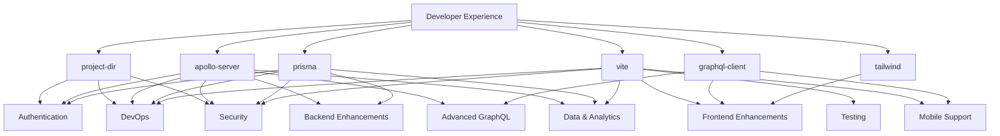

# Candidate Features Overview

## Introduction

This document provides an overview of all proposed candidate features for the Create Poly App scaffolding tool. These features are designed to enhance the basic scaffolding with production-ready capabilities, better developer experience, and comprehensive functionality for modern web applications.

## Feature Categories

### 1. Authentication & Authorization

**Priority: HIGH** | **File: [01-authentication-authorization.md](./01-authentication-authorization.md)**

Essential security features including:

- JWT and session-based authentication
- OAuth integration (Google, GitHub, etc.)
- Role-based access control (RBAC)
- Password security and recovery
- Multi-factor authentication

**Dependencies:** `prisma`, `apollo-server`, `vite`

### 2. Testing Infrastructure

**Priority: HIGH** | **File: [02-testing-infrastructure.md](./02-testing-infrastructure.md)**

Comprehensive testing capabilities including:

- Unit testing with Jest and Testing Library
- End-to-end testing with Playwright/Cypress
- API testing and mocking
- Visual regression testing
- CI/CD integration

**Dependencies:** `vite`, `apollo-server`

### 3. Backend Enhancements

**Priority: MEDIUM-HIGH** | **File: [03-backend-enhancements.md](./03-backend-enhancements.md)**

Advanced backend capabilities including:

- File upload and storage
- Email services and templates
- Background job processing
- Caching strategies
- Real-time features with WebSockets

**Dependencies:** `apollo-server`, `prisma`

### 4. Frontend Enhancements

**Priority: MEDIUM-HIGH** | **File: [04-frontend-enhancements.md](./04-frontend-enhancements.md)**

Rich frontend features including:

- UI component libraries (Ant Design, Material-UI, Chakra)
- Advanced state management (Redux, Zustand)
- Form handling and validation
- Progressive Web App features
- Internationalization support

**Dependencies:** `vite`, `tailwind`, `graphql-client`

### 5. DevOps & Deployment

**Priority: MEDIUM-HIGH** | **File: [05-devops-deployment.md](./05-devops-deployment.md)**

Production deployment capabilities including:

- Docker containerization
- Environment management
- Monitoring and logging
- Database migrations
- CI/CD pipelines

**Dependencies:** `project-dir`, `prisma`

### 6. Mobile App Support

**Priority: MEDIUM** | **File: [06-mobile-app-support.md](./06-mobile-app-support.md)**

Cross-platform mobile development including:

- React Native setup
- Expo integration
- Shared component libraries
- Native device features
- App store deployment

**Dependencies:** `vite`, `graphql-client`

### 7. Advanced GraphQL Features

**Priority: MEDIUM** | **File: [07-advanced-graphql.md](./07-advanced-graphql.md)**

Enhanced GraphQL capabilities including:

- Real-time subscriptions
- DataLoader for efficient data fetching
- GraphQL Federation
- Advanced caching and optimization
- Schema stitching

**Dependencies:** `apollo-server`, `graphql-client`

### 8. Developer Experience Enhancements

**Priority: MEDIUM** | **File: [08-developer-experience.md](./08-developer-experience.md)**

Improved development workflow including:

- Advanced linting and formatting
- Git automation and hooks
- VS Code workspace configuration
- Hot reload and fast refresh
- Code generation tools

**Dependencies:** All features

### 9. Security Features

**Priority: LOW-MEDIUM** | **File: [09-security-features.md](./09-security-features.md)**

Comprehensive security measures including:

- HTTPS configuration
- CORS and CSP policies
- Input sanitization and validation
- Security audit logging
- Data encryption

**Dependencies:** `apollo-server`, `vite`, `prisma`

### 10. Data & Analytics

**Priority: LOW-MEDIUM** | **File: [10-data-analytics.md](./10-data-analytics.md)**

Business intelligence capabilities including:

- User behavior analytics
- Data visualization and charts
- Advanced search functionality
- Automated reporting
- Business intelligence dashboards

**Dependencies:** `apollo-server`, `prisma`, `vite`

## Implementation Roadmap

### Phase 1: Core Production Features (Weeks 1-4)

1. **Authentication & Authorization** - Essential security foundation
2. **Testing Infrastructure** - Quality assurance foundation
3. **DevOps & Deployment** - Production readiness

### Phase 2: Enhanced Functionality (Weeks 5-8)

4. **Backend Enhancements** - Advanced server capabilities
5. **Frontend Enhancements** - Rich user interfaces
6. **Security Features** - Comprehensive protection

### Phase 3: Advanced Features (Weeks 9-12)

7. **Advanced GraphQL** - Sophisticated data layer
8. **Developer Experience** - Workflow optimization
9. **Data & Analytics** - Business intelligence

### Phase 4: Platform Extension (Weeks 13-16)

10. **Mobile App Support** - Cross-platform capabilities

## Feature Dependencies



## Configuration Strategy

Each feature includes:

- **Standalone configuration** for independent usage
- **Integration points** with existing features
- **Conditional activation** based on project requirements
- **Environment-specific settings** for development/production
- **Migration scripts** for existing projects

## Selection Criteria

Features can be selected based on:

- **Project type** (e-commerce, SaaS, portfolio, etc.)
- **Team size** and expertise
- **Performance requirements**
- **Security requirements**
- **Target platforms** (web, mobile, desktop)
- **Business requirements** (analytics, internationalization, etc.)

## Form Integration

Each feature integrates with the existing forms system:

- **Feature detection** questions
- **Dependency validation**
- **Configuration prompts**
- **Installation confirmation**
- **Post-installation setup**

## Example Feature Selection Flow

```typescript
interface FeatureSelectionConfig {
  projectType: 'saas' | 'ecommerce' | 'portfolio' | 'cms' | 'other'
  teamSize: 'solo' | 'small' | 'medium' | 'large'
  timeline: 'mvp' | 'production' | 'enterprise'
  platforms: ('web' | 'mobile' | 'desktop')[]
  requirements: {
    authentication: boolean
    payments: boolean
    analytics: boolean
    multiLanguage: boolean
    realTime: boolean
  }
}

// Recommended features based on configuration
const getRecommendedFeatures = (config: FeatureSelectionConfig) => {
  const features: string[] = []

  // Always recommend for production
  if (config.timeline !== 'mvp') {
    features.push('authentication', 'testing', 'devops')
  }

  // E-commerce specific
  if (config.projectType === 'ecommerce') {
    features.push('backend-enhancements', 'security', 'data-analytics')
  }

  // SaaS specific
  if (config.projectType === 'saas') {
    features.push('authentication', 'frontend-enhancements', 'analytics')
  }

  // Mobile requirements
  if (config.platforms.includes('mobile')) {
    features.push('mobile-support')
  }

  return features
}
```

## Getting Started

1. **Review feature documentation** to understand capabilities and requirements
2. **Assess project needs** using the selection criteria
3. **Check dependencies** to ensure proper feature ordering
4. **Configure features** through the interactive forms system
5. **Install incrementally** starting with high-priority features
6. **Test integration** between features as you add them
7. **Customize configuration** for your specific use case

## Contributing

To add new candidate features:

1. Follow the documentation template used by existing features
2. Include implementation details, configuration options, and code examples
3. Define dependencies and integration points
4. Provide installation scripts and setup procedures
5. Add comprehensive package dependencies and version requirements

Each feature should be designed to work independently while integrating seamlessly with the existing scaffolding system and other features.
